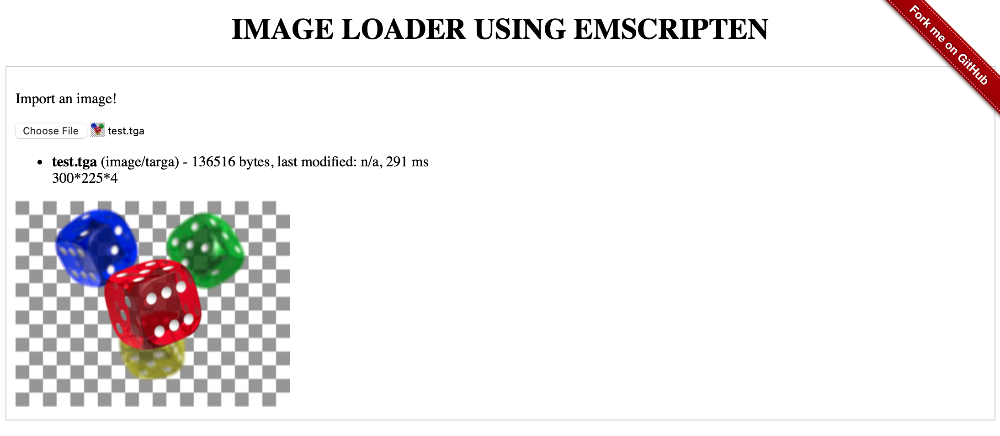

<h1 align="center"><a href="https://anthonyliot.github.io/imageloader/">IMAGE LOADER WITH EMSCRIPTEN</a></h1>

<strong>Load JPG, PNG, WEBP, TGA using Emscripten</strong>
 2023 (Original 2013)

 
<h2>About</h2>
This project was initialy developped to test and experiment with Emscripten, and add the support of any image type accross the browser
 
Developed in 2013, I just refresh the implementation in order to use technologies like Conan, CMake and the Emscripten Binding in order to have a more modern implementation.
 
You can test the Image Loader JS <a href="https://anthonyliot.github.io/imageloader/">here</a>

<h2>Build</h2>

1. Standard build (Desktop)
    1. mkdir build
    1. cd build
    1. cmake .. -DCMAKE_BUILD_TYPE=Release
    1. make

1. Emscripten build
    1. mkdir build
    1. cd build
    1. conan install .. -pr:b default -pr:h ../conanfile.emscripten.profile -s build_type=Release -if . -b missing
    1. cmake .. -DCMAKE_TOOLCHAIN_FILE=conan_toolchain.cmake -DCMAKE_BUILD_TYPE=Release -DBUILD_EMSCRIPTEN=ON
    1. make

<h2>Usage</h2>

1. cd docs
1. python3 -m http.server 8000
1. open your browser to http://localhost:8000

<h2>Copyright</h2>
This project is licensed under the terms of the MIT license. See <a href="LICENSE">license</a>.